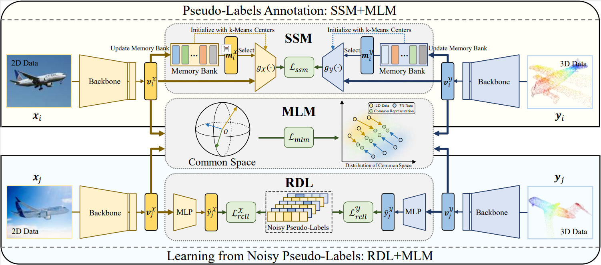

# RoMo
Yongxiang Li, Dezhong Peng and Peng Hu, RoMo: Robust Unsupervised Multimodal Learning for 2D-3D Cross-Modal Retrieval (PyTorch Code)

## Abstract
With the emergence of AI-generated content and the rising volume of heterogeneous 2D and 3D data, cross-modal retrieval between them has become increasingly popular. In many practical scenarios, unsupervised methods prevail over the limitations of acquiring labels, bringing more convenience to real-world applications. However, the lack of label information can also make it more challenging to comprehend the inherent structure and deal with the semantic disparities among different modalities. To tackle these challenges, this paper proposes a 2D-3D unsupervised cross-modal retrieval framework that harnesses multimodal data. Specifically, our proposed framework has two stages, namely the Pseudo Labels Annotation stage (PLA) and the Robust Discriminative Learning stage (RDL). PLA employs an innovative self-matching supervision mechanism, which achieves class label annotation for all samples. RDL extracts knowledge from the noise pseudo-labels by introducing the Robust Concentrating Learning Loss (RCLL). Both PLA and RDL utilize the Common Space Consistency Learning Mechanism (CSCLM) to encourage modality-invariant representations by collapsing modality-specific samples into a common space. Finally, we conducted experiments on four 2D-3D multimodal datasets to verify the effectiveness of our method, which outperforms 12 state-of-the-art methods.

## Framework


## Requirements
```bash
pip install requirements.txt
```

## Dataset
3D MNIST dataset data is currently available for your training and testing. 

If you use raw data [Kaggle-3D MNIST](https://www.kaggle.com/datasets/daavoo/3d-mnist) , suitable data augmentation can bring the performance of the method to a higher level. 

Here, we provide a processed version (https://drive.google.com/file/d/1_qk06tW7HAPmnHCdfgoIX__RgJMxRRyY/view?usp=drive_link) to match with our code. Download, unzip and put it in the ./dataset/

## Pre-Trained Model for Feature Extraction Network
2D modaility Pre-Trained Model will automatic download.

Dgcnn in the 3D modaility Pre-trained Model can access in the https://drive.google.com/file/d/1lnvyf2Gh5Dy19yzQ6cx-a9IaX_BChpae/view?usp=drive_link. Download and put it in the ./pretrained/

## Quickly Training
### PLA Stage:
```python
python train_step1.py
```
After train_step1, you will get the pseudo-labels (***mnist3d_PointCloud_train_list_pseudo_labelling.txt***, ***mnist3d_RGBImgs_train_list_pseudo_labelling.txt***) in the current directory.

### RDL Stage:
```python
python train_step2.py
```

## Reproduction of Results
According the above steps, you can get outputs as follows:
### PLA Stage:
```
(2024.3.11)
===> Building Models..
===> Start from scratch

Epoch: 0 / 20000
[PVI]: First Mixed Cluster ACC : 0.1938
[PVI]: Second RGBImg Modal Mixed Cluster ACC: 0.4624
[PVI]: Second PointCloud Modal Mixed Cluster ACC: 0.1428
 [================== 100/100 =================>]  Step: 459ms | Tot: 49s457ms | Loss: 7.131 | LR: 0.001

[PVI]: After Training RGBImg Modal Cluster ACC: 0.1814
[PVI]: After Training PointCloud Modal Cluster ACC: 0.1798

Epoch: 1 / 20000
 [================== 100/100 =================>]  Step: 459ms | Tot: 51s986ms | Loss: 4.744 | LR: 0.001
[PVI]: After Training RGBImg Modal Cluster ACC: 0.245
[PVI]: After Training PointCloud Modal Cluster ACC: 0.1906

Epoch: 2 / 20000
 [================== 100/100 =================>]  Step: 505ms | Tot: 50s447ms | Loss: 2.269 | LR: 0.001     
[PVI]: After Training RGBImg Modal Cluster ACC: 0.3376
[PVI]: After Training PointCloud Modal Cluster ACC: 0.2584

Epoch: 3 / 20000
 [================== 100/100 =================>]  Step: 505ms | Tot: 50s447ms | Loss: 1.916 | LR: 0.001
[PVI]: After Training RGBImg Modal Cluster ACC: 0.3554
[PVI]: After Training PointCloud Modal Cluster ACC: 0.3044

Epoch: 4 / 20000
 [================= 100/100 ==================>]  Step: 534ms | Tot: 47s43ms | Loss: 1.707 | LR: 0.001  
[PVI]: After Training RGBImg Modal Cluster ACC: 0.377
[PVI]: After Training PointCloud Modal Cluster ACC: 0.332

Epoch: 5 / 20000
 [================= 100/100 ==================>]  Step: 534ms | Tot: 47s43ms | Loss: 1.539 | LR: 0.001
[PVI]: After Training RGBImg Modal Cluster ACC: 0.3734
[PVI]: After Training PointCloud Modal Cluster ACC: 0.336

Epoch: 6 / 20000
 [================= 100/100 ==================>]  Step: 444ms | Tot: 49s819ms | Loss: 1.387 | LR: 0.001
[PVI]: After Training RGBImg Modal Cluster ACC: 0.3994
[PVI]: After Training PointCloud Modal Cluster ACC: 0.3566

Epoch: 7 / 20000
 [================= 100/100 ==================>]  Step: 575ms | Tot: 46s947ms | Loss: 1.254 | LR: 0.001
[PVI]: After Training RGBImg Modal Cluster ACC: 0.3816
[PVI]: After Training PointCloud Modal Cluster ACC: 0.362

Epoch: 8 / 20000
 [================= 100/100 ==================>]  Step: 485ms | Tot: 47s524ms | Loss: 1.118 | LR: 0.001
[PVI]: After Training RGBImg Modal Cluster ACC: 0.3898
[PVI]: After Training PointCloud Modal Cluster ACC: 0.3552
```
### RDL Stage:
```
(2024.3.11)
===> Building Models..
===> Start from scratch

Epoch: 16 / 20000
 [================= 500/500 ==================>]  Step: 176ms | Tot: 42s681ms | Loss: 2.892 | LR: 0.0001     
Validation(mAP): RGBImg2PointCloud: 0.854629    PointCloud2RGBImg: 0.835917     Avg: 0.845273
Test(mAP): RGBImg2PointCloud: 0.849378  PointCloud2RGBImg: 0.831153     Avg: 0.840266
Saving..

Epoch: 17 / 20000
 [================= 500/500 ==================>]  Step: 170ms | Tot: 42s378ms | Loss: 2.731 | LR: 0.0001         
Validation(mAP): RGBImg2PointCloud: 0.854415    PointCloud2RGBImg: 0.830215     Avg: 0.842315

Epoch: 18 / 20000
 [================= 500/500 ==================>]  Step: 171ms | Tot: 42s475ms | Loss: 2.671 | LR: 0.0001        
Validation(mAP): RGBImg2PointCloud: 0.855244    PointCloud2RGBImg: 0.827297     Avg: 0.841271
```

## Thanks
Thanks for the reference and assistance provided by the following work for this code repository.
```
https://github.com/penghu-cs/MRL
@inproceedings{hu2021MRL,
   title={Learning Cross-Modal Retrieval with Noisy Labels},
   author={Peng Hu, Xi Peng, Hongyuan Zhu, Liangli Zhen, Jie Lin},
   booktitle={Proceedings of the IEEE/CVF Conference on Computer Vision and Pattern Recognition},
   pages={5403--5413},
   year={2021}
}
```
```
https://github.com/penghu-cs/RONO
@InProceedings{Feng_2023_CVPR,
    author    = {Feng, Yanglin and Zhu, Hongyuan and Peng, Dezhong and Peng, Xi and Hu, Peng},
    title     = {RONO: Robust Discriminative Learning With Noisy Labels for 2D-3D Cross-Modal Retrieval},
    booktitle = {Proceedings of the IEEE/CVF Conference on Computer Vision and Pattern Recognition (CVPR)},
    month     = {June},
    year      = {2023},
    pages     = {11610-11619}
}
```
